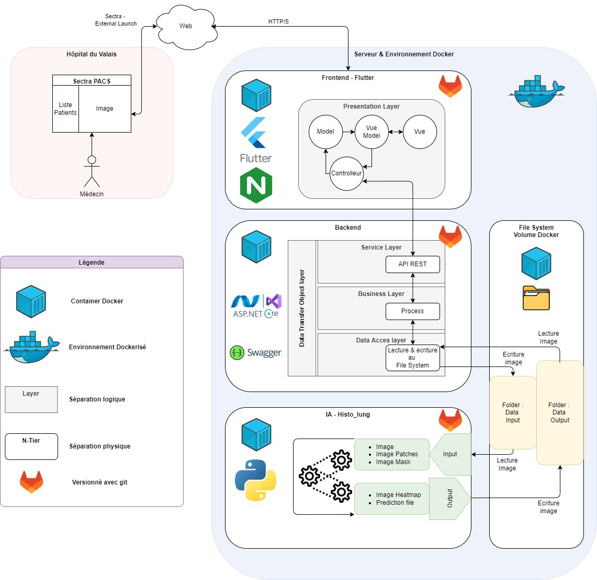
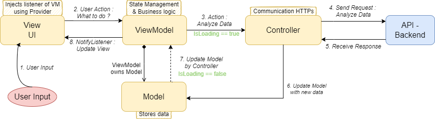

# Sectra Pacs Plugin - Frontend

## Introduction

This project is the frontend for the **Sectra Pacs Plugin** application, developed with Flutter. The application is intended to be deployed on the web and uses Docker for building and deployment. This README provides the necessary information to understand, configure, and deploy the application's frontend.

## Prerequisites

- **Flutter 3.22.2**: Ensure you have installed version 3.22.2 of Flutter. You can install it from the [official website](https://flutter.dev).
- **Docker & Docker Compose**: You need Docker and Docker Compose installed on your machine to build and deploy the application.


## Development Workflow

### 1. SSH Connection and Development

Development is done directly on the server via an SSH connection from IntelliJ IDEA. This allows real-time coding on the production server.

### 2. Build Image

To test locally, build first the necessary image for the docker compose to use:
```bash
./docker-build-image.sh
```

### 3. Running Services Locally

To test locally, use Docker Compose to start the necessary services:
```bash
./docker-compose-run.sh
```

### 4. Build and Deployment

When you are ready to deploy a new version, follow these steps:

1. **Stop the current Docker services:**
   ```bash
   docker compose down
   ```

2. **Clean up existing Docker images:**
   ```bash
   docker rmi -f $(docker images -q)
   ```

3. **Rebuild the Flutter Docker image:**
   ```bash
   bash docker-build-image.sh
   ```

4. **Restart Docker services with the new image:**
   ```bash
   docker compose up -d
   ```

This process is automated in the `rebuild-frontend-deploy.sh` script, which you run after each modification.

### 4. Nginx Configuration

The application uses Nginx to serve the built files. The `nginx.conf` configuration file handles HTTP and HTTPS requests, redirects API requests, and manages SSL certificates for a secure connection.

## Dependencies

The project uses several essential dependencies to function correctly:

- **Flutter 3.22.2**: Main framework for developing the application.
- **Docker & Docker Compose**: For managing containers and orchestrating services.
- **Nginx**: To serve web files and handle HTTPS requests.

## Useful Commands

- **Build the application for the web:**
  ```bash
  flutter build web --release
  ```

- **Run the application locally with Docker:**
  ```bash
  docker-compose up
  ```

- **Deploy a new version:**
  ```bash
  ./rebuild-frontend-deploy.sh
  ```

## Project Architecture

Below is the overall architecture of the Sectra Pacs Plugin, including both the frontend and backend components:



## MVCVM Pattern

The application follows the MVCVM (Model-View-Controller-ViewModel) pattern. Here is an illustration of how this pattern is implemented:



## Code Overview

The Sectra Pacs Plugin frontend is built with a clear and structured architecture following the **MVCVM** pattern (Model-View-Controller-ViewModel). Below is a brief overview of the key components:

### 1. **Model**
- **HistolungModel**: Represents the core data structure used in the application. This class handles the conversion between JSON and Dart objects, storing critical information like predictions and heatmaps.

### 2. **ViewModel**
- **HistolungViewModel**: Manages the state of the application and serves as a bridge between the UI (View) and the backend logic (Controller). It fetches data from the controller, updates the state, and notifies the UI of any changes.

### 3. **Controller**
- **HistolungController**: Interacts with the backend API. It sends HTTP requests, processes the responses, and updates the model accordingly. The controller handles all the business logic related to data fetching and processing.

### 4. **View**
- **HistolungPage**: The main UI component that displays the heatmap and prediction details. It uses a combination of StatelessWidgets and Provider for state management and dependency injection.

### 5. **Utilities**
- **HttpOverrides**: This utility is used to bypass SSL certificate verification during development. **Important**: This should be removed in production as it poses a security risk.

### Notes:
- **Security**: The current implementation uses `HttpOverrides` to bypass SSL verification, which is useful for testing with self-signed certificates. However, this should be removed before deploying to production, where proper SSL certificates should be used.
- **Error Handling**: The code includes robust error handling, especially in the controller, to manage various failure scenarios such as timeouts and failed API requests.
- **State Management**: The use of `ChangeNotifier` and `Provider` for state management is a clean and efficient approach. It allows for easy updates and reactivity in the UI.

### Project Structure

The project follows a modular structure, with a clear separation of concerns between the different components:

```
lib/
│
├── controllers/
│   └── histolung_controller.dart       // Handles interactions with the API
│
├── models/
│   └── histolung_model.dart            // Represents the data structure
│
├── viewmodels/
│   └── histolung_viewmodel.dart        // Manages the state and business logic
│
├── views/
│   ├── histolung_page.dart             // UI components
│   └── widgets/                        // Reusable UI widgets
│       └── image_heatmap.dart          // Heatmap display widget
│
├── services/
│   └── httpOverrides.dart              // Custom HTTP overrides for SSL
│
└── main.dart                           // Application entry point
```

This structure promotes maintainability, scalability, and ease of testing.

## Additional Documentation

For more details on Flutter development, see the [Flutter documentation](https://docs.flutter.dev/).
